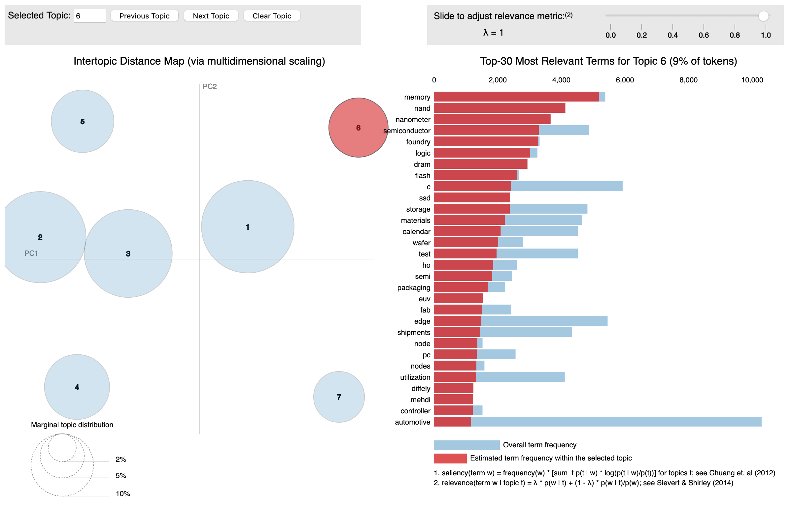

# LDA Final
Peter Goff

I used 4,440 transcripts from quarterly earnings calls from 464 publicly traded technology companies to determine the themes of topics discussed in the question and answer portion of the call. What follows is the path I took to find that I have no better idea what those topics might be now than I did when started this project last month.  

What was I expecting to find? Since the quatertly earnings calls are strongly driven by the content of the quarterly earnings reports filed by the SEC and the SEC requires these reports to engage, among other things, the fiscal health of the organization, I expected to uncover topics that related to these broader elements of the company. For example, any major lawsuits the organization is engaged in should be discussed in these reports. As a result I might expect to find a topic that discusses legal issues, driven by terms such as "lawsuit", "legal", "plaintiff", and "patent".  

I began by isolating the question-and-answer section and cleaning the text for analysis. This included making all text lowercase and removing numbers, common English stopwords, and common names. This reduced the question-and-answer transcript from an average length of 4,548 words to just under 2,000. All well and good.   

My next task was to determine the number of topics within this corpus. I was looking for a high-level perspective, so anywhere between 4 and 10 topics seemed reasonable. In my initial explorations of the data I created a promising 7-topic Latent Dirichlet Allocation (LDA) model. Those topics included, for example, a topic pertaining to memory features, which would be of seminal importance to companies in the technology sector. This domain is shown as topic 6 in the visualization below, and is characterized by terms such as "memory", "nanometer", "semiconductor", "storage", and "wafer". Other topics including Energy ("solar", "energy", "watts"), Mobile ("game", "app", "store"), and Cyber-security ("threat", "intelligence", "secure") appeared viable. A visualization of that model is shown below.
  

### Validation on Price Changes
At this point, I decided that the selection of the 7-topic model would be strengthened by other corroborating evidence. The evidence that struck me as the most persuasive was that of the final outcome: stock price movement. Using stock prices from the 7 (open trading) days prior to the call and the 7 days following, I created a target variable that represented a trifurcation of the data: Those stocks that increased by 5% or more, those that held to within 5% of their pre-call price, and those that declined by 5% or more. Roughly one quarter of observations showed increases, one half held steady, and one quarter declined.  

Building on the best practices of data-science, I sought to use a train-test approach to gather data leading me to the optimal number of topics. I began by isolating 20% of my transcripts as a final test set. Yes, I realize that I already transgressed the train, validate, test approach by my initial exploration using the full data set. Mia culpa.  

With this data aside, I randomly split my remaining data into a topic-training set (80%) and a topic-validation set (20%). I trained an LDA model on the topic-training set, applied it to the topic-validation set, then sent the topic-validation set - along with the newly assigned topic features - to a 5-fold cross-validation XGBoost classification model and collected the outcome metrics (f1 scores, specifically). For each number of topics, I repeated this process 5 times, each time randomly selecting a new topic-testing and topic-validation set. I repeated this process for models with 4, 5, 6, 7, 8, 9, 10, 12, 14, 18, and 24 topics. The f1 scores for each set are shown below.  

This plot showed, some indication of an optimum topic count at 5. Perhaps. However, the first set of results that this process produced showed that 8 topics would be best (I had to reset for the evening and when I restarted the next day, the plot you see above is what was genereated). Don't let the ups and downs mislead you - the values are clustered pretty tightly around the 0.46 mark and the first batch was too. I suspect that the small sample size by the time the topics arrived at the final testing of the classification cycle significantly increased the variance and hampered predictive power. Thus I was no farther along than I was before.  

My next thought was to look for more proximal evidence to support the topic structure - something like perplexity and coherence. The perpelxity and coherence plots are shown below. This time I abandoned the test-train approach for topic structure and opted for the power of the whole sample.   

### A More Precise Model
Alas, this approach provided no smoking bullet to lead me the optimal topic structure. Nevertheless, I had other plans to explore. Specifically, I thought that the more precise Gibbs sampling algorithm used by the MAchine Learning for LanguagE Toolkit (MALLET) may pick up on signal and structure that Gensim's more efficient Variational Bayes sampling algorithm overlooked. The Coherence plot from that series of models shown below shows little, if any, relation to the parallel model produced above.  

### Instability of the Topic Modeling Approach
Although this was discouraging, I was not yet ready to fold. Recalling the my preliminary exploration with the 7-topic model, I sought to retrace my steps, intending to further explore that structure and determine if those topics might have, for example, a temporal trend over the last few years or perhaps an alignment with specific stocks. Here again the process deteriorated. LDA is an inherently probabilistic process, so a modicum of variation is to be expected. And yet the 7-topic model that was generated upon the next go-round and the time after that ... and the time after that, bore no conceptual resemblance to the initial 7-topic model that appeared so promising early on. For the sake of comparison, one of those models is shown below. 

### Semi-supervised Topic Modeling 
This was not ideal. And yet, I saw a viable path forward in the [Corex](https://pypi.org/project/corextopic/) approach. My thinking was that I could use the terms from the original 7-topic model to seed topics and guide the semi-supervised approach in Corex to recreate those topics. And it worked! Sort of. But not really. The model was able to identify the topics with very little prodding (that is, a very low anchor strength of 1.5 needed to idnetify the topics). However, the model couldn't associate topics with documents. The average document had a 99% probability of being classified as 3 distinct topics (that is, 0.99 for topic X, 0.99 for topic Y, and 0.99 for topic Z). Fewer than 20% of documents showed a clear classification into a single topic.  

### Topic Modeling Followed By Clustering
I had one more approach that I thought may help identify a legimate topic structure within this text. My final strategy was to estimate a bundle of topics and then use a clustering technique sort them into 5-10 topics. Using an initial set of 50 and then 25 LDA topics and searching across epsilon values and neighbors per cluster, DBSCAN was unable to identify any clustering structure that did not yield 90% of all observations into a single cluster ... aside from clustering schemes that generated *more* clusters than topics.  
