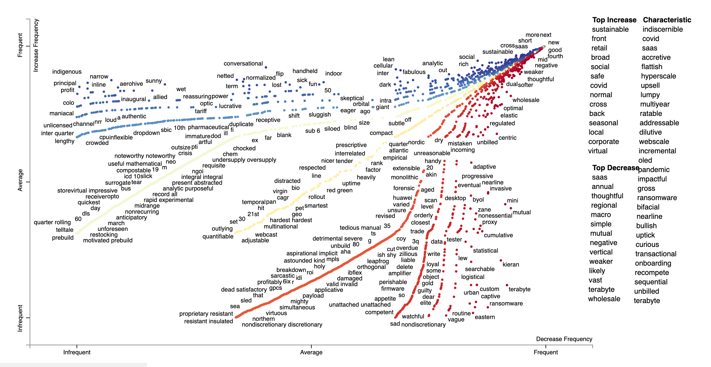
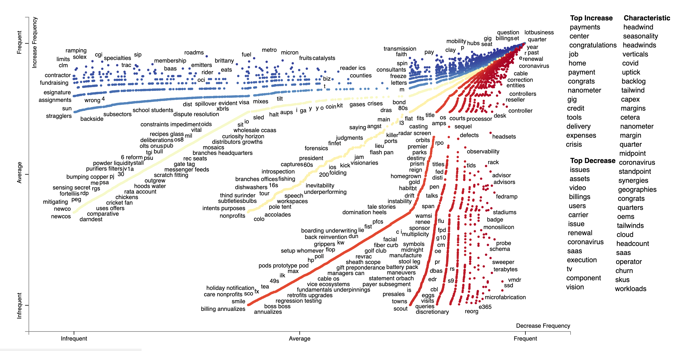
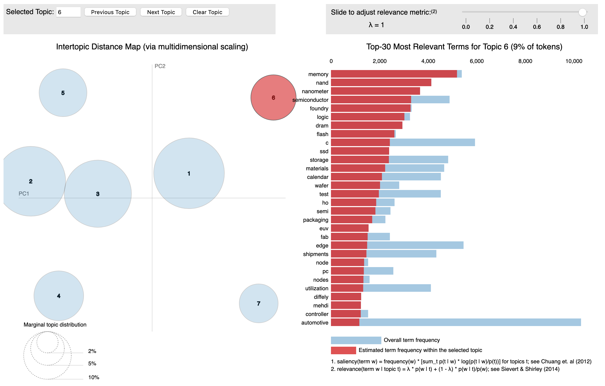

# Metis Unsupervised Project MVP
Peter Goff

## Goal: Predict the impact of quarterly earning reports on stock behavior
In quarterly earning reports, company leadership shares perspectives on the company, their fundamentals, challenges, mission, direction, investments, and general fiscal health of the organization. Quarterly earning calls are (typically) recorded conference calls where leadership summarizes the earnings report and often engages questions from those outside the organization. This project explores the features of earnings calls - specifically the question-and-answer sessions - that coincide with changes in stock value.  
The content and sentiment of the call both shape public receptivity and direct subsequent action on the part of investors. Thus, the two key features for this study will be topic affiliation and sentiment. Additional market-based and call-based measures will be integrated as well.

### Defining the target
The target outcome for this study is stocks that have (a) increased in value (5% or more) in the week following the quarterly earnings call; (b) decreased in value (5% or more); or (c) held fairly constant following the earnings call. To temper against stochastic fluctuations, I have calculated each company's average stock price from the week prior to the call and compared this with the average stock price in the week following the call. 

### Features
The primary features for this study will topic affiliation and sentiment. Preliminary exploratory data analysis was conducted by cleaning and pre-processing the data using Spacy to identify nouns and adjectives. The intent here is to distill transcript content to a form where we can determine what is being discussed (nouns) and how it is being discussed (adjectives). Scattertext was used to create visualizations of a random subset of transcripts (20%), contrasting stocks that gained with those that declined. The results for adjectives is shown below, followed by the plot for nouns. 

Sentiment analysis was conducted using the finance-tuned Loughran-McDonald Sentiment [Word Lists](https://sraf.nd.edu/textual-analysis/resources/https://sraf.nd.edu/textual-analysis/resources/) as implemented by [pysentiment2](https://pypi.org/project/pysentiment2/).
These measures operate largely as expected, with calls from companies that increased following the call showing polarity values nearly 4 times greater than those that declined (0.0375 versus 0.0100). Subjectivity measures for the two groups was nearly identical (0.0689 versus 0.0692).  

Topic affiliation has been determined via latent dirichlet allocation (lda). Content comparisons of several low-dimensional models tentitively suggest that a seven-topic model may contain a viable set of substantive topics. Those topics include, for example, a topic pertaining to memory features, which would be of seminal importance across companies in the technology sector. This domain is shown as topic 6 in the visualization below, and is characterized by terms such as "memory", "nanometer", "semiconductor", "storage", and "wafer".

Work remains to further validate the topic model and integrate the topics as features along with sentiment into the classification model.

